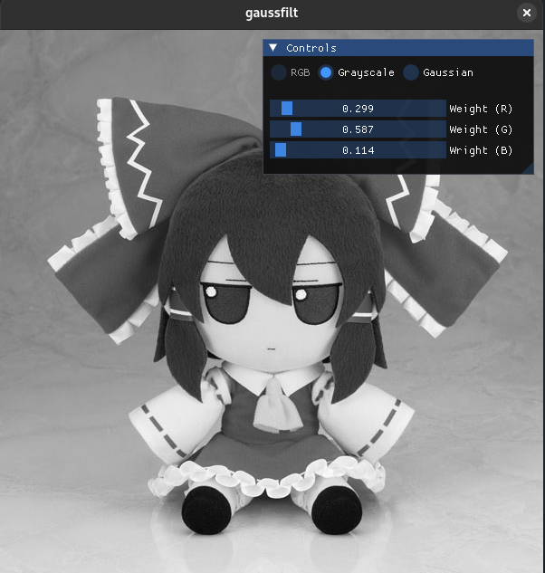

# GaussFilt

Play with Gaussian filter!
<p align="left">


</p>

The actual Gaussian Filter is not implemented yet.

So far, what you can do,

- GrayScale

## Usage

```bash
./gaussfilt --help
```

## Building

You need vcpkg. Please install it and set the `VCPKG_ROOT` path.
Once the above is done, clone this repo.

Use CMake with the provided `CMakePresets.json` to build this project. CMake will automatically take care of building of third party libraries used from source through vcpkg.
