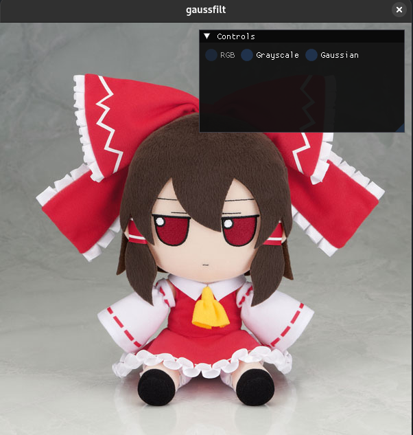

# GaussFilt

Play with Gaussian Blur!

<p align="left">



</p>

## Usage

```bash
./gaussfilt --input <path/to/image> --gui
```

### TO

- CLI implementation
- Batch processing
- Performance Improvement

## Building

You need vcpkg. Please install it and set the `VCPKG_ROOT` path.
Once the above is done, clone this repo.

Use CMake with the provided `CMakePresets.json` to build this project. CMake will automatically take care of building of third party libraries used from source through vcpkg.
